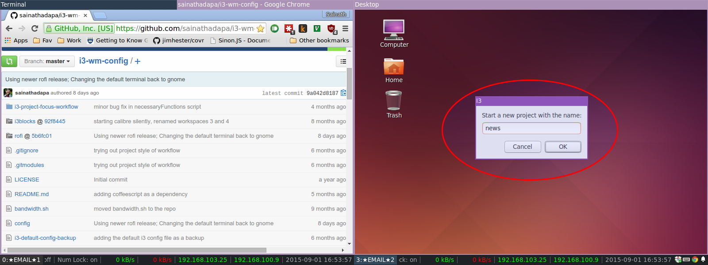
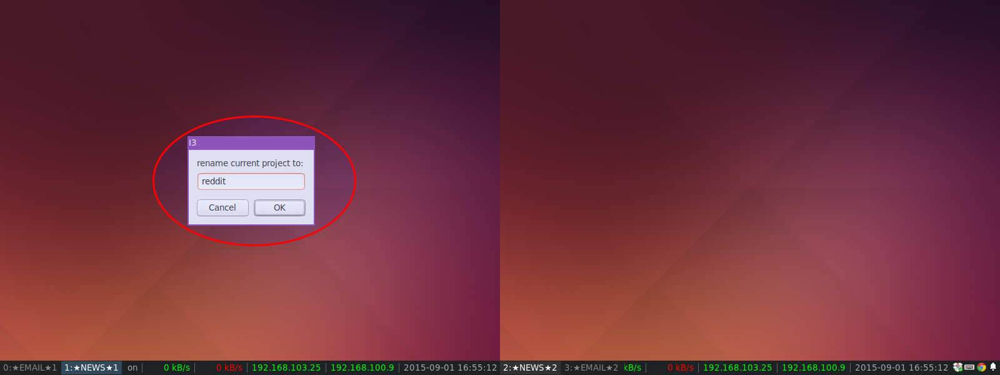

***[Demo video showing the capabilities](https://youtu.be/_IU-GckAc5I)***

At my workplace, I have a dual monitor setup, with Ubuntu, and [I3](https://i3wm.org/) as the window manager. Being a tiling window manager, I3 allows me to effectively use all the display space, and arrange the windows quickly in different shapes and sizes.

Typically, I have a browser and a terminal (or multiple terminals) on one monitor, and IDE on another. I also generally have multiple such sets of workspaces. Each such set (one workspace for each monitor) represents a project that I am working on. 

This is how the I3 bar looks for me on a typical day:

Monitor 1:
`1:projectA | 3:projectB | 5:projectC`

Monitor 2:
`2:projectA | 4:projectB | 6:projectC`

Now, to switch from working on Project A to Project B, I need to invoke three commands -

(Workspace 1 is focused, Workspace 2 is in a focused inactive state on the other monitor)

1. `$mod+3` to switch to Workspace 3 from Workspace 1 on the first monitor
2. `$mod+2` to focus Workspace 2 on the second monitor
3. `$mod+4` to switch to Worspace 4 from Workspace 2 on the second monitor 

Three commands is an inefficient way to do such a simple & regular task. So, I wrote a script, using which I can achieve the above with one command. This was back in September 2015. Since then, I wrote more scripts to easily navigate and move windows in a multi-monitor setup with I3. And yes, it also works with more than two monitors.

# How to install
1. Install `zenity`, in case if it is not present. This utility is present on most gnome based linux systems. 
2. Download the scripts individually or clone the repo
3. Bind the scripts to shortcut keys in the I3 config file

# Terminology
A project is defined as a set of workspaces, one workspace for each display/monitor available.

# Usage

## newProjectWorkspaces.py

To create a new project, run the `newProjectWorkspaces.py` script. This will display a dialog box asking for the project name. Names of the workspaces will contain the project name.

Dialog box:


After:


## renameProject.py

To rename a project, run `renameProject.py`. This will display a dialog box asking for the new project name.

Dialog box:


After:


## switchNextProject.py

To switch to the next project, run `switchNextProject.py`

## cycleProjectWorkspacesFocus.py

To cycle the focus between the workspaces in a project, run `cycleProjectWorkspacesFocus.py`

## cycleProjectWorkspacesOutput.py

To shift all the workspaces in a project to each one's respective next display, run `cycleProjectWorkspacesOutput.py`. For example, if the initial state of the workspaces is {Wksp 1 - Disp 1}, {Wksp 2 - Disp 2}, {Wksp 3 - Disp 3}, after running the script, the final state will be {Wksp 1 - Disp 2}, {Wksp 2 - Disp 3}, {Wksp 3 - Disp 1}.

Initial state:


After running the script:


## cycleContainerProjectWorkspaces.py

To switch the focused container to the next workspace in the project, run `cycleContainerProjectWorkspaces.py`.

Initial state:


After running the script:


# Sample I3 config
To use the scripts, add these lines to your I3 config:

``` sh
# project workflow bindings
bindsym $mod+Shift+p     exec python3~/.3/i3-project-focus-workflow/newProjectWorkspaces.py
bindsym $mod+p           exec python3~/.i3/i3-project-focus-workflow/switchNextProject.py
bindsym $mod+Tab         exec python3~/.i3/i3-project-focus-workflow/cycleProjectWorkspacesFocus.py
bindsym $mod+Shift+Tab   exec python3~/.i3/i3-project-focus-workflow/cycleProjectWorkspacesOutput.py
bindsym $mod+Control+Tab exec python3~/.i3/i3-project-focus-workflow/cycleContainerProjectWorkspaces.py
bindsym $mod+n           exec python3~/.i3/i3-project-focus-workflow/renameProject.py

# create a initial project on startup with project name 'default'
exec --no-startup-id python3 ~/.i3/i3-project-focus-workflow/newProjectWorkspaces.py default
```

 
